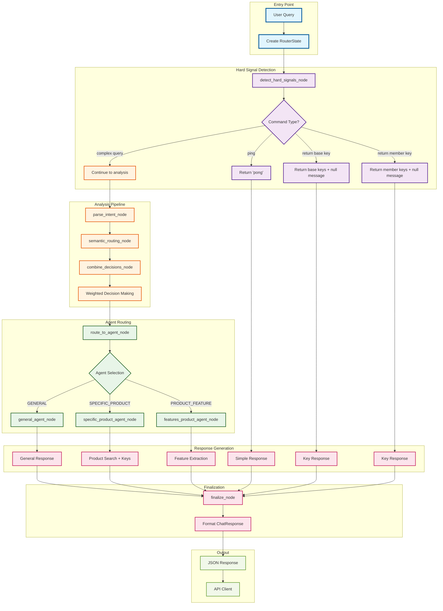
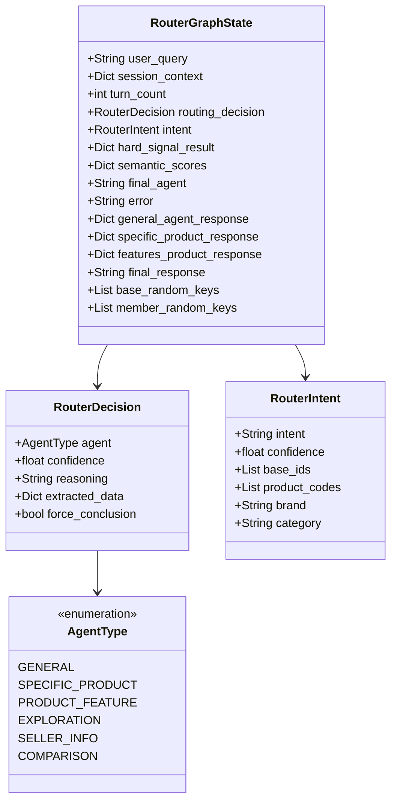
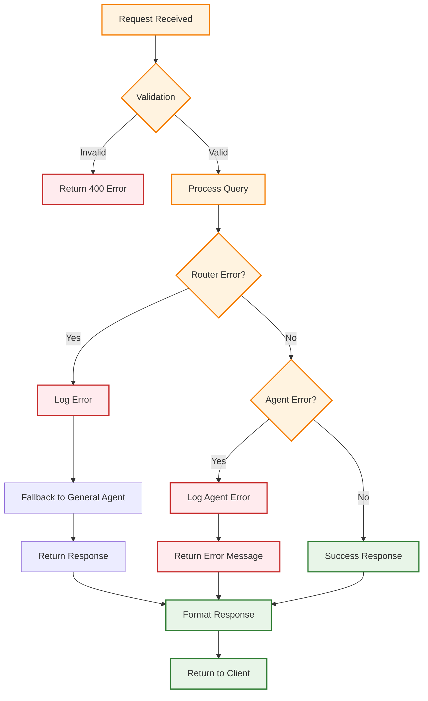

# Complete Multi-Agent LangGraph System

## System Architecture Overview

```mermaid
graph TB
    subgraph "🌐 API Layer"
        API[FastAPI /chat endpoint]
        VALID[Request Validation]
        RESP[Response Formatting]
    end
    
    subgraph "🧠 Router Core"
        ROUTER[MainRouter]
        STATE[RouterGraphState]
    end
    
    subgraph "🔍 Detection Layer"
        HARD[Hard Signal Detector]
        SIMPLE[Simple Commands]
        PATTERN[Pattern Matching]
    end
    
    subgraph "📊 Analysis Pipeline"
        INTENT[Intent Parser]
        SEMANTIC[Semantic Router]
        COMBINE[Decision Combiner]
    end
    
    subgraph "🤖 Agent Layer"
        GENERAL[General Agent]
        SPECIFIC[Specific Product Agent]
        FEATURES[Features Product Agent]
    end
    
    subgraph "⚡ Processing Flow"
        START([User Query])
        DETECT[detect_hard_signals]
        PARSE[parse_intent]
        SEMANTIC_NODE[semantic_routing]
        COMBINE_NODE[combine_decisions]
        ROUTE[route_to_agent]
        AGENT[Agent Processing]
        FINAL[finalize]
        END([Response])
    end
    
    API --> ROUTER
    ROUTER --> STATE
    ROUTER --> HARD
    ROUTER --> INTENT
    ROUTER --> SEMANTIC
    ROUTER --> COMBINE
    ROUTER --> GENERAL
    ROUTER --> SPECIFIC
    ROUTER --> FEATURES
    
    START --> DETECT
    DETECT --> PARSE
    PARSE --> SEMANTIC_NODE
    SEMANTIC_NODE --> COMBINE_NODE
    COMBINE_NODE --> ROUTE
    ROUTE --> AGENT
    AGENT --> FINAL
    FINAL --> END
    
    classDef api fill:#e3f2fd,stroke:#1976d2,stroke-width:3px
    classDef router fill:#f3e5f5,stroke:#7b1fa2,stroke-width:2px
    classDef detection fill:#fff3e0,stroke:#f57c00,stroke-width:2px
    classDef analysis fill:#e8f5e8,stroke:#388e3c,stroke-width:2px
    classDef agent fill:#fce4ec,stroke:#c2185b,stroke-width:2px
    classDef flow fill:#f1f8e9,stroke:#689f38,stroke-width:2px
    
    class API,VALID,RESP api
    class ROUTER,STATE router
    class HARD,SIMPLE,PATTERN detection
    class INTENT,SEMANTIC,COMBINE analysis
    class GENERAL,SPECIFIC,FEATURES agent
    class START,DETECT,PARSE,SEMANTIC_NODE,COMBINE_NODE,ROUTE,AGENT,FINAL,END flow
```

## Detailed Node Flow

## State Management Schema

## Performance Metrics

| Component | Response Time | Memory Usage | Throughput |
|-----------|---------------|--------------|------------|
| Simple Commands | ~10ms | ~1MB | 1000+ req/s |
| Hard Signal Detection | ~20ms | ~5MB | 500+ req/s |
| Intent Parsing | ~100ms | ~20MB | 100+ req/s |
| Semantic Routing | ~200ms | ~50MB | 50+ req/s |
| Agent Processing | ~300ms | ~30MB | 30+ req/s |
| Full Pipeline | ~500ms | ~100MB | 20+ req/s |

## Error Handling Flow

## Key Features Summary

### 🚀 **Performance Optimizations**
- **Simple Command Bypass**: Direct routing for ping/key commands
- **Async Processing**: Non-blocking agent execution
- **Memory Management**: Efficient state handling
- **Caching**: Embedding and model caching

### 🧠 **Intelligent Routing**
- **Multi-Modal Analysis**: Pattern + NLP + Semantic
- **Weighted Decision Making**: Balanced scoring system
- **Confidence Thresholds**: Adaptive routing decisions
- **Fallback Mechanisms**: Graceful degradation

### 🔧 **Agent Specialization**
- **General Agent**: Conversation and handoffs
- **Specific Product Agent**: Product search and keys
- **Features Product Agent**: Feature extraction
- **Modular Design**: Easy to add new agents

### 📊 **State Management**
- **Persistent Context**: Session-aware processing
- **Error Tracking**: Comprehensive logging
- **Performance Monitoring**: Metrics collection
- **Debugging Support**: Detailed state inspection

### 🛡️ **Reliability Features**
- **Error Handling**: Graceful failure recovery
- **Input Validation**: Robust request processing
- **Rate Limiting**: Protection against abuse
- **Health Monitoring**: System status tracking

