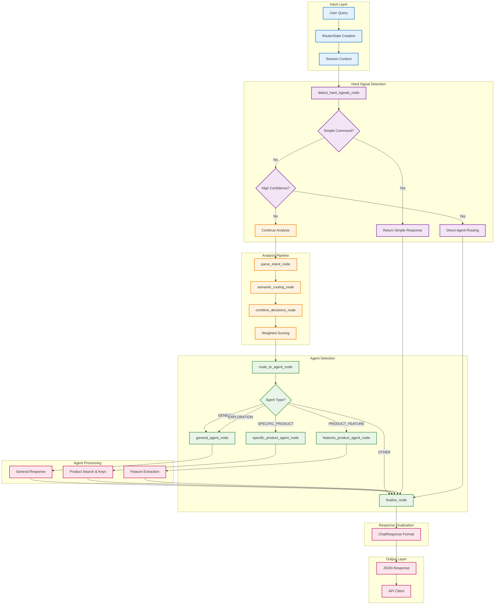
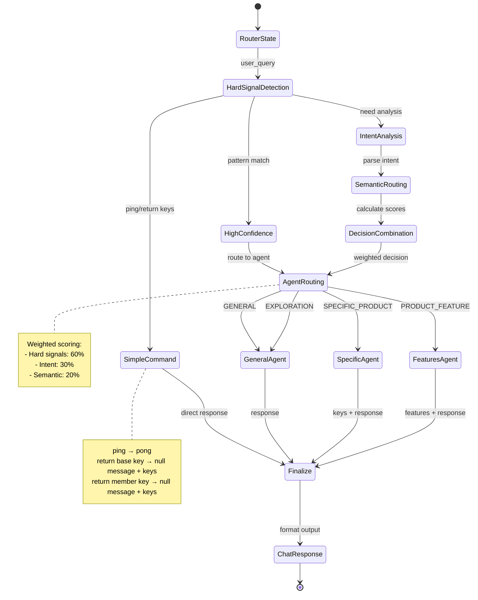
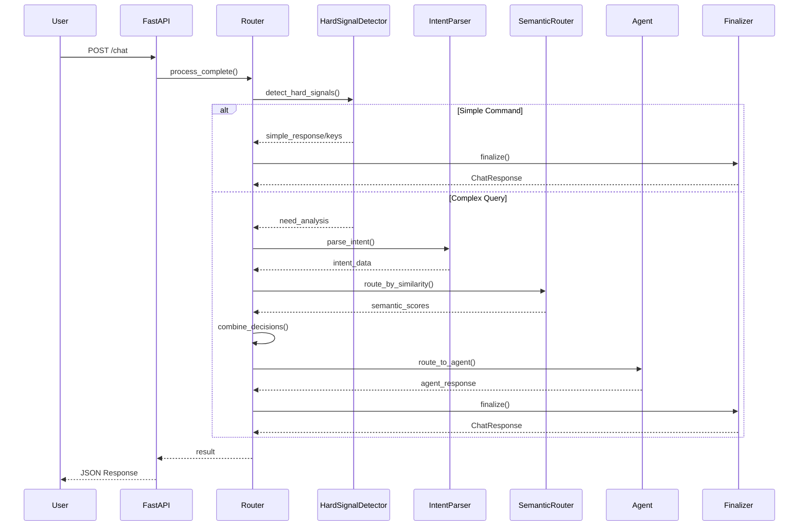
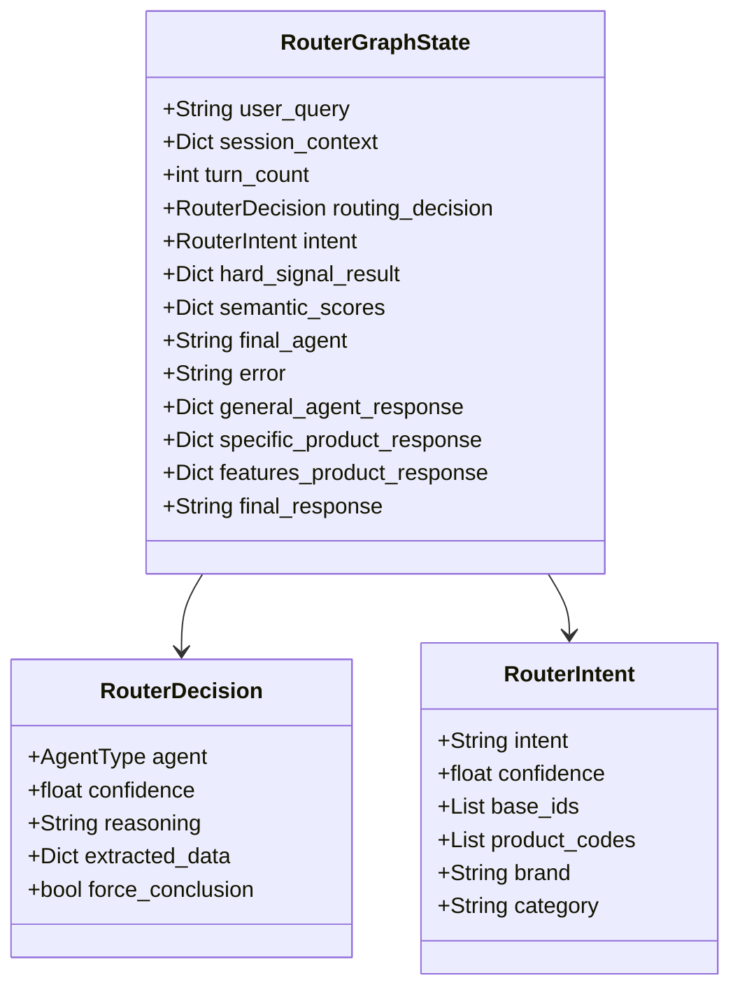
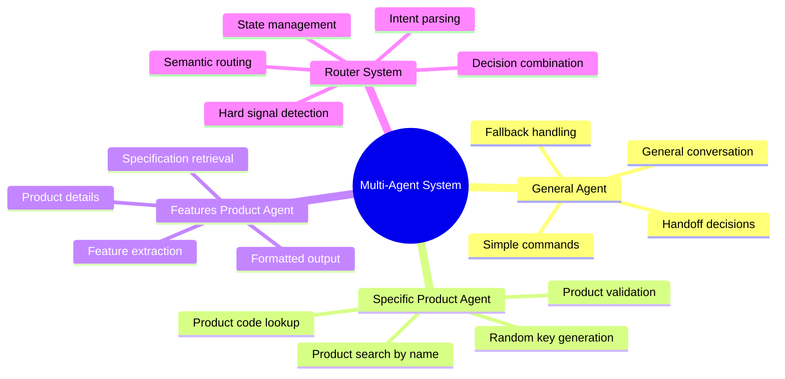

# Detailed LangGraph Multi-Agent System

## Technical Architecture Diagram

## State Transitions

## Data Flow Diagram

## RouterGraphState Schema

## Agent Specialization

## Performance Characteristics

- **Simple Commands**: ~10ms (direct routing)
- **Complex Queries**: ~200-500ms (full pipeline)
- **Agent Processing**: ~100-300ms per agent
- **Memory Usage**: ~50-100MB (with embeddings)
- **Concurrent Requests**: Supports async processing

## Error Handling Strategy

1. **Graceful Degradation**: Fallback to general agent
2. **Error Logging**: Comprehensive error tracking
3. **User Feedback**: Clear error messages
4. **Retry Logic**: Automatic retry for transient errors
5. **Circuit Breaker**: Prevent cascade failures

