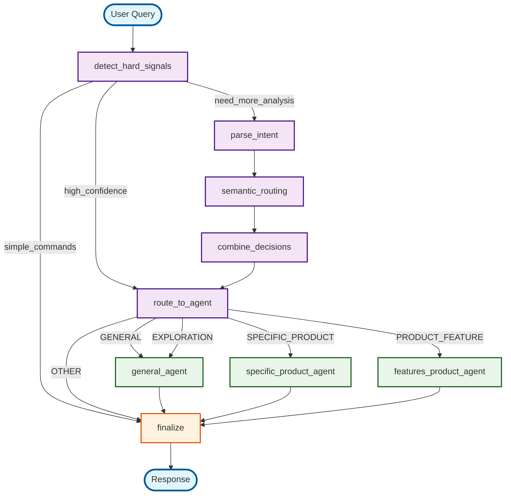

# Multi-Agent LangGraph System Visualization

## System Overview
This document shows the visual representation of the multi-agent routing system using LangGraph.

## Graph Structure



## Node Descriptions

### Routing Nodes
- **detect_hard_signals**: Detects simple commands (ping, return keys) and high-confidence patterns
- **parse_intent**: Analyzes user intent using NLP
- **semantic_routing**: Uses embeddings to find similar examples
- **combine_decisions**: Combines all routing decisions with weighted scoring
- **route_to_agent**: Prepares for agent routing

### Agent Nodes
- **general_agent**: Handles general queries and conversation
- **specific_product_agent**: Finds specific products by name/code
- **features_product_agent**: Retrieves product features and specifications

### Decision Nodes
- **finalize**: Finalizes response and handles simple commands

## Routing Logic

### 1. Hard Signal Detection
- **Simple Commands**: `ping` → `pong`, `return base random key: X` → keys only
- **High Confidence**: Direct routing to appropriate agent
- **Need Analysis**: Continue to intent parsing

### 2. Intent Analysis
- Parse user intent using NLP
- Extract entities (product codes, brands, categories)
- Determine confidence level

### 3. Semantic Routing
- Use embeddings to find similar examples
- Calculate similarity scores for each agent type
- Provide additional routing signals

### 4. Decision Combination
- Weighted scoring: Hard signals (60%), Intent (30%), Semantic (20%)
- Select best agent based on combined scores
- Handle turn budget and force conclusion

### 5. Agent Execution
- **GENERAL**: General conversation and assistance
- **SPECIFIC_PRODUCT**: Find specific products, return random keys
- **PRODUCT_FEATURE**: Get product features and specifications
- **EXPLORATION**: Route to general agent (not implemented separately)

## State Management

The system uses `RouterGraphState` to manage:
- User query and session context
- Routing decisions and confidence scores
- Agent responses and final output
- Error handling and logging

## Key Features

1. **Simple Command Handling**: Direct response for ping and key commands
2. **Multi-Modal Routing**: Combines pattern matching, NLP, and semantic similarity
3. **Weighted Decision Making**: Balances different routing signals
4. **Agent Specialization**: Each agent handles specific types of queries
5. **Error Handling**: Graceful fallback to general agent
6. **State Persistence**: Maintains context across conversation turns

## API Response Format

```json
{
  "message": "Response text or null for key-only responses",
  "base_random_keys": ["key1", "key2"],
  "member_random_keys": ["key3", "key4"]
}
```

## Example Flows

### Simple Command Flow
```
User: "ping" → detect_hard_signals → finalize → Response: "pong"
```

### Product Search Flow
```
User: "iPhone 15" → detect_hard_signals → parse_intent → semantic_routing → 
combine_decisions → route_to_agent → specific_product_agent → finalize → 
Response: random keys
```

### General Query Flow
```
User: "How are you?" → detect_hard_signals → parse_intent → semantic_routing → 
combine_decisions → route_to_agent → general_agent → finalize → 
Response: conversational response
```

